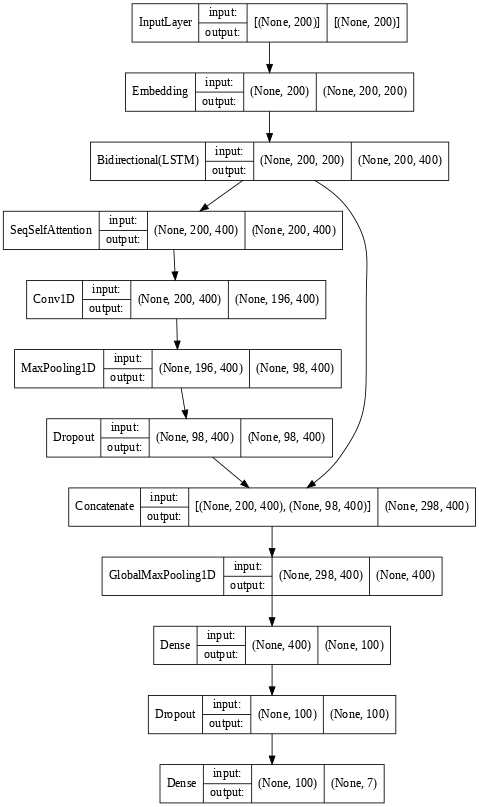

# Emotion Detection

Project work for the "Deep Learning" course of the Artificial Intelligence Master's Degree at University of Bologna.

## Problem

The task consists in creating an Emotion Detection model, able to recognise the emotion expressed in a given
text/sentence.

## Dataset

The [dataset](./data) is composed of 58k texts labelled manually to assign them an emotion:

- Anger
- Digust
- Fear
- Joy
- Sadness
- Surprise
- Neutral

## Preprocessing

The following processing step have been performed:

- Expansion of the contracted forms;
- Conversion of emoji to text;
- Removal of the Saxon genitive;
- Specific preprocessing for Gloove;
- Specific tokenization for twitter text.

## First Model

    

## Second Model

    

## Results

The best model for the F1-score metric is the first model for better score, since it reaches a F1-score of 0.61 with
about 7M parameters to train.

## Bibliography

1 Polignano, Marco & Basile, Pierpaolo & de Gemmis, Marco & Semeraro, Giovanni. (2019). "A Comparison of
Word-Embeddings in Emotion Detection from Text using BiLSTM, CNN and Self-Attention". \\
https://www.researchgate.net/publication/333740389_A_Comparison_of_Word-Embeddings_in_Emotion_Detection_from_Text_using_BiLSTM_CNN_and_Self-Attention

2 S.bai, J. Kolter, and V. Koltun, "An empirical Evaluation of Generic Convolutional and Recurrent Networks
for Sequence Modelling", *arXiv*, April, 2018

3 C.Henkel, "Temporal Convolutional Network", *Kaggle*,
https://www.kaggle.com/code/christofhenkel/temporal-convolutional-network/notebook